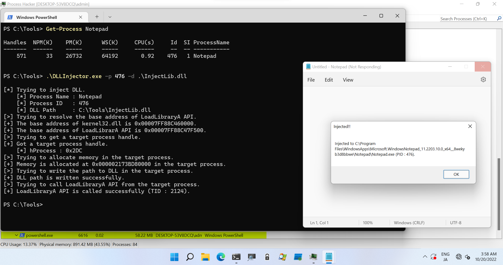
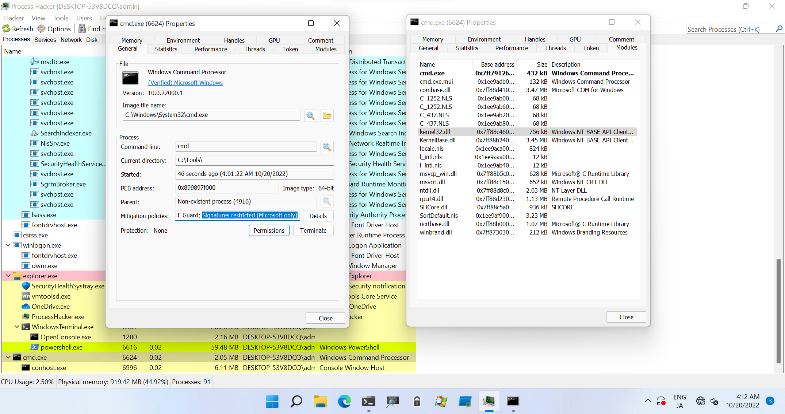

# Blocking DLL

Tools in this directory are for testing blocking DLL process.

| PoC Name | Description |
| :--- | :--- |
| [InjectLib](./InjectLib) | DLL for testing DLL Injection. |
| [DLLInjector](./DLLInjector) | Tool for testing DLL Injection. Use with [InjectLib](./InjectLib). |
| [BlockingDLLProcessSpawn](./BlockingDLLProcessSpawn) | Tool for spawning blocking DLL process. |
| [RemoteCodeInjector](./RemoteCodeInjector) | Tool for testing Classical Remote Code Injection. |
| [SelfDefend](./SelfDefend) | PoC to demonstrate self defend mechanism by `SetMitigationPolicy` API. Set the process itself as MicrosoftSignedOnly signature policy. |


## Example

For example, if you inject a custom DLL `InjectLib.dll` (not signed DLL) to normal executed process such as `notepad.exe`, you can confirm message box of `InjectLib.dll` from the target process as following screenshot:



But if you execute some process with `BlockingDLLProcessSpawn.exe` and try to inject a custom DLL `InjectLib.dll` to the spawned process, you will not see any message box:

```
PS C:\Tools> .\BlockingDLLProcessSpawn.exe -c cmd

[>] Trying to initialize STARTUPINFOEX structure.
[+] STARTUPINFOEX structure is initialized successfully.
[>] Trying to update thread attribute.
[+] Thread attribute is updated successfully.
[>] Trying to create a blocking DLL process.
[+] Blocking DLL process is created successfully.
    [*] Command Line : cmd
    [*] PID          : 6624
[*] Done.

PS C:\Tools> .\DLLInjector.exe -p 6624 -d .\InjectLib.dll

[*] Trying to inject DLL.
    [*] Process Name : cmd
    [*] Process ID   : 6624
    [*] DLL Path     : C:\Tools\InjectLib.dll
[>] Trying to resolve the base address of LoadLibraryA API.
[+] The base address of kernel32.dll is 0x00007FF88C460000.
[+] The base address of LoadLibrarA API is 0x00007FF88C47F500.
[>] Trying to get a target process handle.
[+] Got a target process handle.
    [*] hProcess : 0x2C0
[>] Trying to allocate memory in the target process.
[+] Memory is allocated at 0x000001EE9ADE0000 in the target process.
[>] Trying to write the path to DLL in the target process.
[+] DLL path is written successfully.
[>] Trying to call LoadLibraryA API from the target process.
[+] LoadLibraryA API is called successfully (TID : 544).

PS C:\Tools>
```

Using Process Hacker, you can confirm that `Signatures restricted (Microsoft only)` is set to `Mitigation policy` of the spawned process, and `InjectLib.dll` is not appeared in `Modules` tab as following screenshot:

