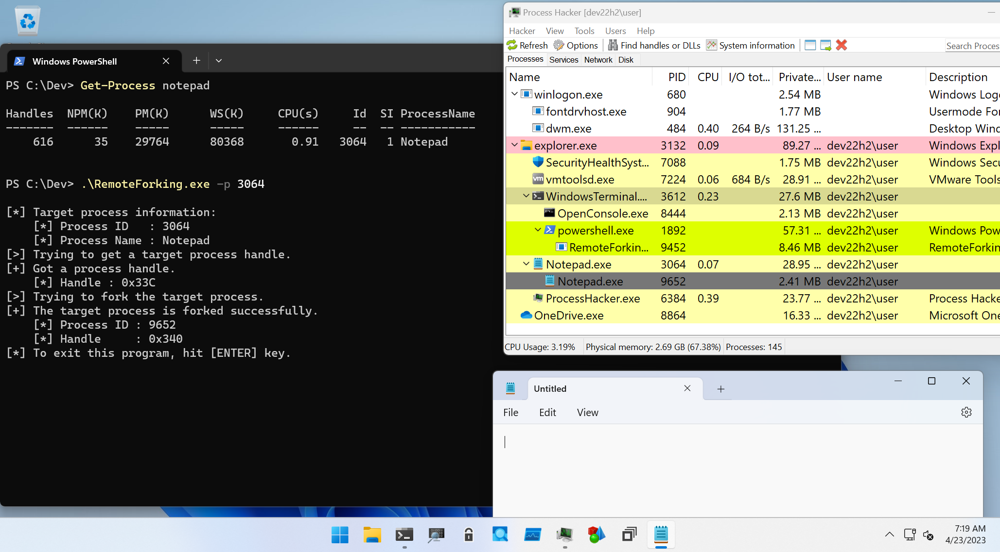

# Clone Process

This directory is for PoC about process forking and reflection.

## RemoteForking

This is a PoC to test forked process memory:

```
PS C:\Dev> .\RemoteForking.exe -h

RemoteForking - PoC to test process snapshotting.

Usage: RemoteForking.exe [Options]

        -h, --help   : Displays this help message.
        -p, --pid    : Specifies process ID.
        -s, --system : Flag to act as SYSTEM.
        -d, --debug  : Flag to enable SeDebugPrivilege.
```

To use this tool, simply specify PID of your target process with `-p` option as follows:

```
PS C:\Dev> Get-Process notepad

Handles  NPM(K)    PM(K)      WS(K)     CPU(s)     Id  SI ProcessName
-------  ------    -----      -----     ------     --  -- -----------
    616      35    29764      80368       0.91   3064   1 Notepad


PS C:\Dev> .\RemoteForking.exe -p 3064

[*] Target process information:
    [*] Process ID   : 3064
    [*] Process Name : Notepad
[>] Trying to get a target process handle.
[+] Got a process handle.
    [*] Handle : 0x33C
[>] Trying to fork the target process.
[+] The target process is forked successfully.
    [*] Process ID : 9652
    [*] Handle     : 0x340
[*] To exit this program, hit [ENTER] key.
```

If you have administrative privilege and want to use SYSTEM privilege, set `-s` flag.
To enable SeDebugPrivilege, set `-d` flag.




## SnapshotDump

This tool is to dump process memory with snapshot technique:

```
PS C:\Dev> .\SnapshotDump.exe -h

SnapshotDump - Tool to get process dump with snapshot techniques.

Usage: SnapshotDump.exe [Options]

        -h, --help   : Displays this help message.
        -o, --output : Specifies output file path. Default will be based on process name and PID.
        -p, --pid    : Specifies process ID.
        -s, --system : Flag to act as SYSTEM.
        -d, --debug  : Flag to enable SeDebugPrivilege.
```

To use this tool, set the target PID with `-p` option.
If you have administrative privilege and want to use SYSTEM privilege, set `-s` flag:

```
PS C:\Dev> Get-Process winlogon

Handles  NPM(K)    PM(K)      WS(K)     CPU(s)     Id  SI ProcessName
-------  ------    -----      -----     ------     --  -- -----------
    266      23     2528       5536       0.20    680   1 winlogon


PS C:\Dev> .\SnapshotDump.exe -p 680 -s

[*] Target process information:
    [*] Process ID   : 680
    [*] Process Name : winlogon
[>] Trying to impersonate as SYSTEM.
[*] Impersonation is successful.
[>] Trying to get a target process handle.
[+] Got a process handle.
    [*] Handle : 0x2D4
[>] Trying to get snapshot process.
[+] Got a target process snapshot successfully.
    [*] Process ID : 924
    [*] Handle     : 0x2DC
[>] Dumping snapshot process.
    [*] Output Path : C:\Dev\winlogon_680.dmp
[+] Snapshot process is dumped successfully.
[*] Done.
```

Output file path is specified with `-o` option.
In default, output file path is based on target process name and PID.
SeDebugPrivilege can be enabled with `-d` flag.