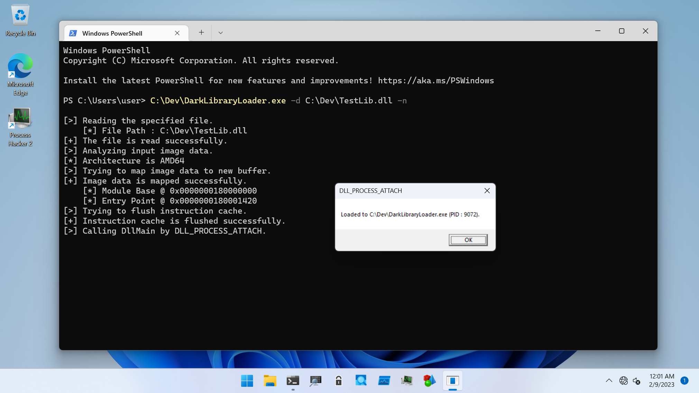

# Dark Load Library

Codes in this directory for Dark Load Library techniques by [@\_batsec\_](https://twitter.com/_batsec_).
Currently, supports only x64 process.

## TestLib

This DLL is a sample for testing the technique.
Simply pops up message box with `MessageBox` API.

## DarkLibraryLoader

This tool tries to load DLL with the Dark Load Library technique.

```
PS C:\Users\user> C:\Dev\DarkLibraryLoader.exe

DarkLibraryLoad - PoC for testing Dark Load Library technique.

Usage: DarkLibraryLoader.exe [Options]

        -h, --help   : Displays this help message.
        -d, --dll    : Specifies DLL to load.
        -n, --nolink : Flag to not link DLL.

[!] -d option is required.

PS C:\Users\user>
```

To load DLL, simply specifies your DLL with `-d` option:

```
PS C:\Users\user> C:\Dev\DarkLibraryLoader.exe -d C:\Dev\TestLib.dll

[>] Reading the specified file.
    [*] File Path : C:\Dev\TestLib.dll
[+] The file is read successfully.
[>] Analyzing input image data.
[*] Architecture is AMD64
[>] Trying to map image data to new buffer.
[+] Image data is mapped successfully.
    [*] Module Base @ 0x0000000180000000
    [*] Entry Point @ 0x0000000180001420
[>] Trying to link DLL to PEB.
    [*] Full DLL Path : C:\Users\Public\DarkLib.dll
    [*] Base DLL Name : DarkLib.dll
[+] DLL is linked successfully.
[>] Trying to flush instruction cache.
[+] Instruction cache is flushed successfully.
[>] Calling DllMain by DLL_PROCESS_ATTACH.
[*] Done.
```

If you want to not link your DLL to PEB, set `-n` flags as following:

```
PS C:\Users\user> C:\Dev\DarkLibraryLoader.exe -d C:\Dev\TestLib.dll -n

[>] Reading the specified file.
    [*] File Path : C:\Dev\TestLib.dll
[+] The file is read successfully.
[>] Analyzing input image data.
[*] Architecture is AMD64
[>] Trying to map image data to new buffer.
[+] Image data is mapped successfully.
    [*] Module Base @ 0x0000000180000000
    [*] Entry Point @ 0x0000000180001420
[>] Trying to flush instruction cache.
[+] Instruction cache is flushed successfully.
[>] Calling DllMain by DLL_PROCESS_ATTACH.
[*] Done.
```



## References

* [GitHub - bats3c/DarkLoadLibrary](https://github.com/bats3c/DarkLoadLibrary)
* [Bypassing Image Load Kernel Callbacks](https://www.mdsec.co.uk/2021/06/bypassing-image-load-kernel-callbacks/)

## Acknowledgments

Thanks for your research:

* batsec ([@\_batsec\_](https://twitter.com/_batsec_))