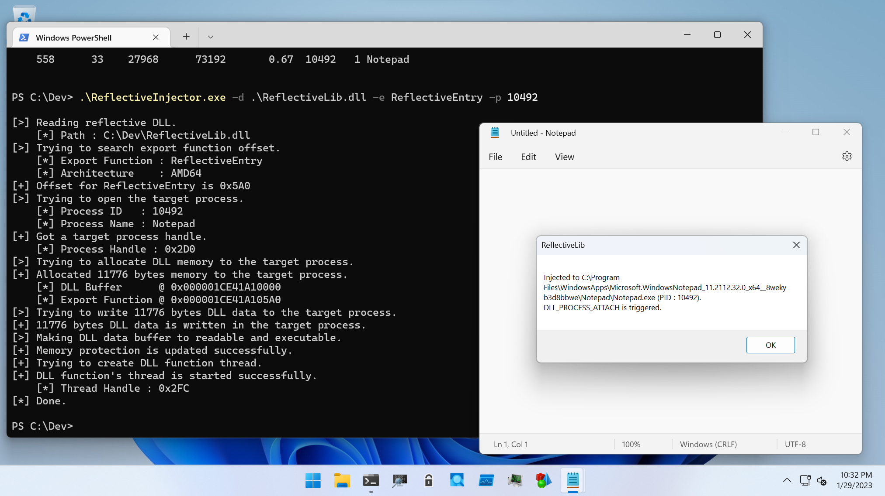
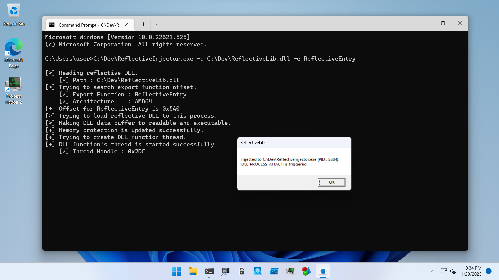

# Reflective DLL Injection

This directory for tools to test Reflective DLL Injection.

| Project | Description |
| :--- | :--- |
| [ReflectiveInjector](./ReflectiveInjector) | This is a tool for testing Reflective DLL Injection. |
| [ReflectiveLib](./ReflectiveLib) | This is a DLL for testing Reflective DLL Injection. The entry point for reflection is named as `ReflectiveEntry`. |
| [CalcRor13Hash](./CalcRor13Hash) | This calculates ROR13 hash for a string and is used for ReflectiveLib programming. |

> __Warning__
>
> Currently, only supports AMD64 process. Other architecture support will be added later.

To avoid memory error, `ReflectiveLib` must be build without stack cookie.

## ReflectiveInjector

IF you want to inject reflective DLL to other process, must be specifies the target PID (`-p` option), path for reflective DLL (`-d` option) and reflective loader function's name (`-e` option):

```
C:\Dev>.\ReflectiveInjector.exe -d .\ReflectiveLib.dll -e ReflectiveEntry -p 10100

[>] Reading reflective DLL.
    [*] Path : C:\Dev\ReflectiveLib.dll
[>] Trying to search export function offset.
    [*] Export Function : ReflectiveEntry
    [*] Architecture    : AMD64
[+] Offset for ReflectiveEntry is 0x5A0
[>] Trying to open the target process.
    [*] Process ID   : 10100
    [*] Process Name : Notepad
[+] Got a target process handle.
    [*] Process Handle : 0x2D0
[>] Trying to allocate DLL memory to the target process.
[+] Allocated 11776 bytes memory to the target process.
    [*] DLL Buffer      @ 0x000002636AB90000
    [*] Export Function @ 0x000002636AB905A0
[>] Trying to write 11776 bytes DLL data to the target process.
[+] 11776 bytes DLL data is written in the target process.
[>] Making DLL data buffer to readable and executable.
[+] Memory protection is updated successfully.
[+] Trying to create DLL function thread.
[+] DLL function's thread is started successfully.
    [*] Thread Handle : 0x2DC
[*] Done.
```



To load reflective DLL into `ReflectiveInjector`'s process, only specify path for reflective DLL (`-d` option) and reflective loader function's name (`-e` option):

```
C:\Dev>.\ReflectiveInjector.exe -d .\ReflectiveLib.dll -e ReflectiveEntry

[>] Reading reflective DLL.
    [*] Path : C:\Dev\ReflectiveLib.dll
[>] Trying to search export function offset.
    [*] Export Function : ReflectiveEntry
    [*] Architecture    : AMD64
[+] Offset for ReflectiveEntry is 0x5A0
[>] Trying to load reflective DLL to this process.
[>] Making DLL data buffer to readable and executable.
[+] Memory protection is updated successfully.
[+] Trying to create DLL function thread.
[+] DLL function's thread is started successfully.
    [*] Thread Handle : 0x2DC
[*] Done.
```




## CalcRor13Hash

This tool is to calculate ROR13 hash of API name or DLL name for reflective DLL customization or shellcoding.
If you want to calculate the hash for ASCII string, set name with `-a` option.
For reliability, all letters are converted to uppercase before calculation.

```
C:\Dev\>.\CalcRor13Hash.exe -a GetProcAddress

[*] Input (ASCII) : GetProcAddress
[*] ROR13 Hash    : 0x1ACAEE7A

C:\Dev\>.\CalcRor13Hash.exe -a GetPRocADdrEss

[*] Input (ASCII) : GetPRocADdrEss
[*] ROR13 Hash    : 0x1ACAEE7A
```

To caluculate for Unicode string, set name with `-u` option:

```
C:\dev\Projects\TangledWinExec\ReflectiveDLLInjection\bin\Release>CalcRor13Hash.exe -u kernel32.dll

[*] Input (Unicode) : kernel32.dll
[*] ROR13 Hash      : 0x6A4ABC5B
```


## Reference

* [GitHub - stephenfewer/ReflectiveDLLInjection](https://github.com/stephenfewer/ReflectiveDLLInjection)


## Acknowledgments

* Stephen Fewer ([@stephenfewer](https://twitter.com/stephenfewer))