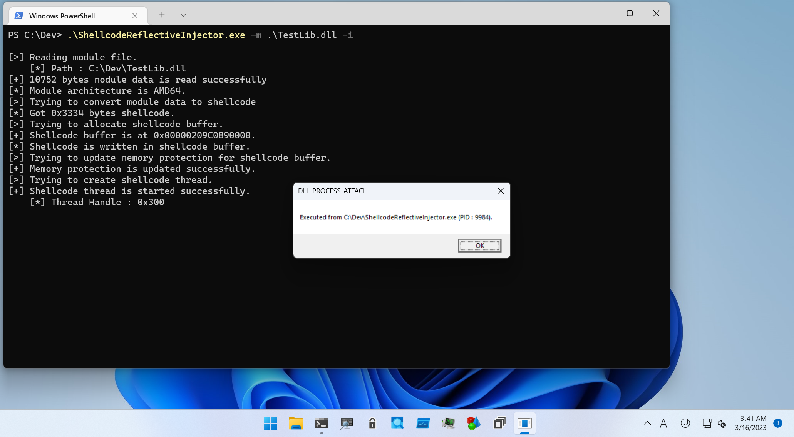
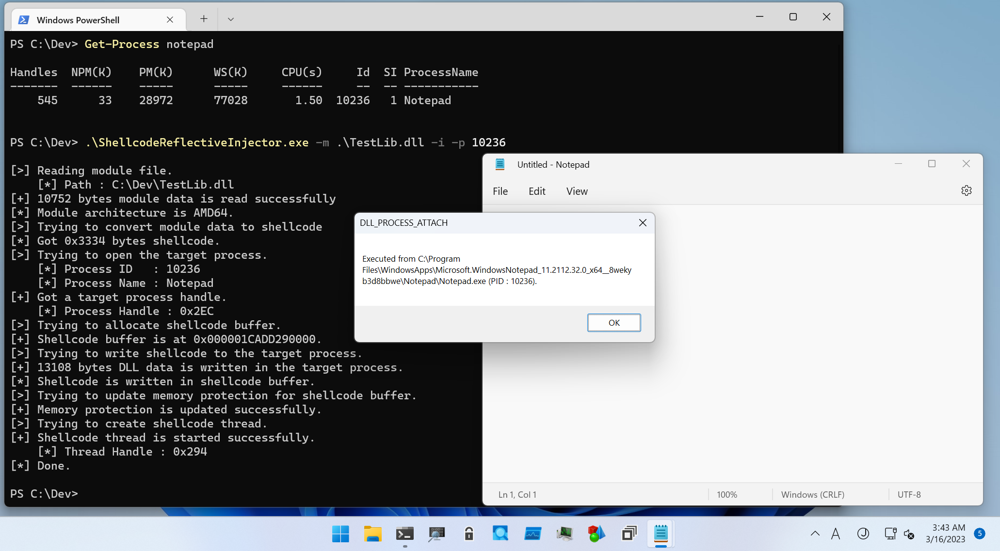

# Shellcode Reflective DLL Injection

This directory is for tools to test sRDI (Shellcode Reflective DLL Injection).

## TestLib

This DLL is for testing sRDI.
Simply pops up message box from loaded process.

## ReflectiveLoader

This program is a source of reflective loader shellcode.
Must be built as Release build.
Code in `.text` section corresponds to reflective loader shellcode.

## ShellcodeReflectiveInjector

This tool is to test sRDI:

```
PS C:\Dev> .\ShellcodeReflectiveInjector.exe

ShellcodeReflectiveInjector - Tool to test sRDI (Shellcode Reflective DLL Injection).

Usage: ShellcodeReflectiveInjector.exe [Options]

    -h, --help    : Displays this help message.
    -c, --convert : Flag to convert PE to shellcode.
    -i, --inject  : Flag to inject or load shellcode.
    -f, --format  : Specifies output format of dump data. "cs", "c" and "py" are allowed.
    -m, --module  : Specifies a PE file to generate shellcode.
    -p, --pid     : Specifies PID to inject shellcode.

[!] -m option is required.
```

To load DLL as shellcode, specifies DLL file with `-m` option and set `-i` flag as follows.
DLL will be converted a shellcode to trigger `DLL_PROCESS_ATTACH`:

```
PS C:\Dev> .\ShellcodeReflectiveInjector.exe -m .\TestLib.dll -i

[>] Reading module file.
    [*] Path : C:\Dev\TestLib.dll
[+] 10752 bytes module data is read successfully
[*] Module architecture is AMD64.
[>] Trying to convert module data to shellcode
[*] Got 0x3334 bytes shellcode.
[>] Trying to allocate shellcode buffer.
[+] Shellcode buffer is at 0x0000025DEB180000.
[*] Shellcode is written in shellcode buffer.
[>] Trying to update memory protection for shellcode buffer.
[+] Memory protection is updated successfully.
[>] Trying to create shellcode thread.
[+] Shellcode thread is started successfully.
    [*] Thread Handle : 0x2E4
[*] Done.
```



When PID specified with `-p` option, this tool convert DLL to shellcode and inject it remote process:

```
PS C:\Dev> Get-Process notepad

Handles  NPM(K)    PM(K)      WS(K)     CPU(s)     Id  SI ProcessName
-------  ------    -----      -----     ------     --  -- -----------
    529      33    28008      66320       0.28  10236   1 Notepad


PS C:\Dev> .\ShellcodeReflectiveInjector.exe -m .\TestLib.dll -i -p 10236

[>] Reading module file.
    [*] Path : C:\Dev\TestLib.dll
[+] 10752 bytes module data is read successfully
[*] Module architecture is AMD64.
[>] Trying to convert module data to shellcode
[*] Got 0x3334 bytes shellcode.
[>] Trying to open the target process.
    [*] Process ID   : 10236
    [*] Process Name : Notepad
[+] Got a target process handle.
    [*] Process Handle : 0x2DC
[>] Trying to allocate shellcode buffer.
[+] Shellcode buffer is at 0x000001C85C5A0000.
[>] Trying to write shellcode to the target process.
[+] 13108 bytes DLL data is written in the target process.
[*] Shellcode is written in shellcode buffer.
[>] Trying to update memory protection for shellcode buffer.
[+] Memory protection is updated successfully.
[>] Trying to create shellcode thread.
[+] Shellcode thread is started successfully.
    [*] Thread Handle : 0x2E4
[*] Done.
```



If you only want to export shellcode bytes into a file, set `-c` flag.
Exported files are named as `shellcode.bin` or `shellcode_{index}.bin`:

```
PS C:\Dev> .\ShellcodeReflectiveInjector.exe -m .\TestLib.dll -c

[>] Reading module file.
    [*] Path : C:\Dev\TestLib.dll
[+] 10752 bytes module data is read successfully
[*] Module architecture is AMD64.
[*] Got 0x3334 bytes shellcode.
[*] Export shellcode data to C:\Dev\shellcode.bin.
[*] Done.

PS C:\Dev> .\ShellcodeReflectiveInjector.exe -m .\TestLib.dll -c

[>] Reading module file.
    [*] Path : C:\Dev\TestLib.dll
[+] 10752 bytes module data is read successfully
[*] Module architecture is AMD64.
[*] Got 0x3334 bytes shellcode.
[*] Export shellcode data to C:\Dev\shellcode_0.bin.
[*] Done.

PS C:\Dev> dir shellcode*bin


    Directory: C:\Dev


Mode                 LastWriteTime         Length Name
----                 -------------         ------ ----
-a----         3/16/2023   3:54 AM          13108 shellcode.bin
-a----         3/16/2023   3:54 AM          13108 shellcode_0.bin

PS C:\Dev> Format-Hex .\shellcode.bin


           Path: C:\Dev\shellcode.bin

           00 01 02 03 04 05 06 07 08 09 0A 0B 0C 0D 0E 0F

00000000   E8 00 00 00 00 59 41 B8 2F 09 00 00 4C 01 C1 48  è....YA¸/...L.ÁH
00000010   89 4C 24 08 55 53 56 57 41 54 41 55 41 56 41 57  Ll$áHì...eH.VAW

--snip--
```

To dump converted shellcode in some programming language format, set `-f` option with `-c` flag.
Currentry supports `c` (C/C++), `cs` (CSharp) and `py` (Python):

```
PS C:\Dev> .\ShellcodeReflectiveInjector.exe -m .\TestLib.dll -c -f cs

[>] Reading module file.
    [*] Path : C:\Dev\TestLib.dll
[+] 10752 bytes module data is read successfully
[*] Module architecture is AMD64.
[*] Got 0x3334 bytes shellcode.
[*] Dump shellcode in CSharp format:

var data = new byte[] {
    0xE8, 0x00, 0x00, 0x00, 0x00, 0x59, 0x41, 0xB8, 0x2F, 0x09, 0x00, 0x00,
    0x4C, 0x01, 0xC1, 0x48, 0x89, 0x4C, 0x24, 0x08, 0x55, 0x53, 0x56, 0x57,
    0x41, 0x54, 0x41, 0x55, 0x41, 0x56, 0x41, 0x57, 0x48, 0x8D, 0x6C, 0x24,
    0xE1, 0x48, 0x81, 0xEC, 0x88, 0x00, 0x00, 0x00, 0x65, 0x48, 0x8B, 0x04,

--snip--

[*] Done.
```

## About Update

If you want to update `ReflectiveLoader` shellcode implemented in `ShellcodeReflectiveInjector`, modify values in [`Resources.cs`](./ShellcodeReflectiveInjector/Library/Resources.cs).

To update shellcode of injector, you must get shellcode from modified `ReflectiveLoader.exe`.
For this purpose, I wrote a small tool named `PeRipper` which can get [here](../Misc/PeRipper/).

At first, check shellcode size and location.
If your reflective loader is implemented in one function, it should be located at the top on `.text` section, and the size should be the value of `VirtualSize` for `.text` section as follows:

```
PS C:\Dev> PeRipper.exe -p .\ReflectiveLoader_x64.exe -a

[*] Raw Data Size : 5120 bytes
[*] Architecture  : AMD64
[*] Header Size   : 0x400 bytes
[*] EntryPoint:
    [*] VirtualAddress   : 0x00001000
    [*] PointerToRawData : 0x00000400
[*] Sections (Count = 4):
    [*] .text Section:
        [*] VirtualAddress   : 0x00001000
        [*] PointerToRawData : 0x00000400
        [*] VirtualSize      : 0x925
        [*] SizeOfRawData    : 0xA00
    [*] .rdata Section:
        [*] VirtualAddress   : 0x00002000
        [*] PointerToRawData : 0x00000E00
        [*] VirtualSize      : 0x1B8
        [*] SizeOfRawData    : 0x200
    [*] .pdata Section:
        [*] VirtualAddress   : 0x00003000
        [*] PointerToRawData : 0x00001000
        [*] VirtualSize      : 0xC
        [*] SizeOfRawData    : 0x200
    [*] .rsrc Section:
        [*] VirtualAddress   : 0x00004000
        [*] PointerToRawData : 0x00001200
        [*] VirtualSize      : 0x1E0
        [*] SizeOfRawData    : 0x200
[*] Export functions (Count = 0):
[*] Done.


PS C:\Dev> PeRipper.exe -p .\ReflectiveLoader_x64.exe -v 0x1000 -s 0xa00 -d

[*] Raw Data Size : 5120 bytes
[*] Architecture  : AMD64
[*] Header Size   : 0x400 bytes
[*] VirtualAddress (0x00001000) is in .text section.
[*] Dump 0xA00 bytes in Hex Dump format:

                       00 01 02 03 04 05 06 07 08 09 0A 0B 0C 0D 0E 0F

    0000000000001000 | 48 89 4C 24 08 55 53 56-57 41 54 41 55 41 56 41 | H.L$.USV WATAUAVA
    0000000000001010 | 57 48 8D 6C 24 E1 48 81-EC 88 00 00 00 65 48 8B | WH.l$áH. ì....eH.
    0000000000001020 | 04 25 60 00 00 00 45 33-D2 45 8B F2 4C 89 55 CF | .%`...E3 OE.òL.UI

--snip--

    0000000000001900 | 8B 45 E7 45 33 C0 49 03-D9 48 8D 4A FF FF D0 48 | .EçE3AI. UH.JÿÿDH
    0000000000001910 | 8B 4D 7F 45 33 C0 41 8D-50 01 FF D3 48 8B 45 7F | .M.E3AA. P.ÿOH.E.
    0000000000001920 | E9 7D F9 FF FF 00 00 00-00 00 00 00 00 00 00 00 | é}ùÿÿ... ........
    0000000000001930 | 00 00 00 00 00 00 00 00-00 00 00 00 00 00 00 00 | ........ ........

--snip--

    00000000000019E0 | 00 00 00 00 00 00 00 00-00 00 00 00 00 00 00 00 | ........ ........
    00000000000019F0 | 00 00 00 00 00 00 00 00-00 00 00 00 00 00 00 00 | ........ ........

[*] Done.
```

Then, get shellcode in CSharp format from reflective loader as follows:

```
PS C:\Dev> PeRipper.exe -p .\ReflectiveLoader_x64.exe -v 0x1000 -s 0x925 -f cs -d

[*] Raw Data Size : 5120 bytes
[*] Architecture  : AMD64
[*] Header Size   : 0x400 bytes
[*] VirtualAddress (0x00001000) is in .text section.
[*] Dump 0x925 bytes in CSharp format:

var data = new byte[] {
    0x48, 0x89, 0x4C, 0x24, 0x08, 0x55, 0x53, 0x56, 0x57, 0x41, 0x54, 0x41,
    0x55, 0x41, 0x56, 0x41, 0x57, 0x48, 0x8D, 0x6C, 0x24, 0xE1, 0x48, 0x81,
    0xEC, 0x88, 0x00, 0x00, 0x00, 0x65, 0x48, 0x8B, 0x04, 0x25, 0x60, 0x00,


--snip--

    0xFF, 0xFF, 0xD0, 0x48, 0x8B, 0x4D, 0x7F, 0x45, 0x33, 0xC0, 0x41, 0x8D,
    0x50, 0x01, 0xFF, 0xD3, 0x48, 0x8B, 0x45, 0x7F, 0xE9, 0x7D, 0xF9, 0xFF,
    0xFF
};

[*] Done.
```

Finally, replace the shellcode difined as `x64Loader` (for x64 shellcode) or `x86Loader` (for x86 shellcode) varable to new shellcode.


## References

* [sRDI – Shellcode Reflective DLL Injection](https://www.netspi.com/blog/technical/adversary-simulation/srdi-shellcode-reflective-dll-injection/)

* [GitHub - monoxgas/sRDI](https://github.com/monoxgas/sRDI)

* [An Improved Reflective DLL Injection Technique](https://disman.tl/2015/01/30/an-improved-reflective-dll-injection-technique.html)

## Acknowlegments

* Nick Landers ([@monoxgas](https://twitter.com/monoxgas))